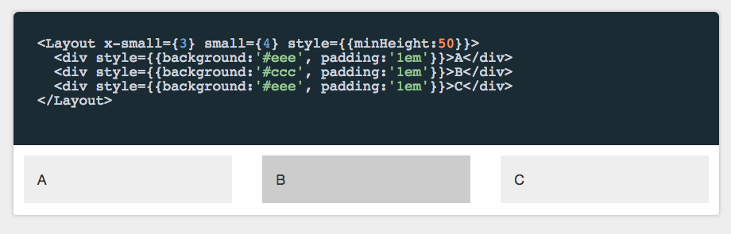
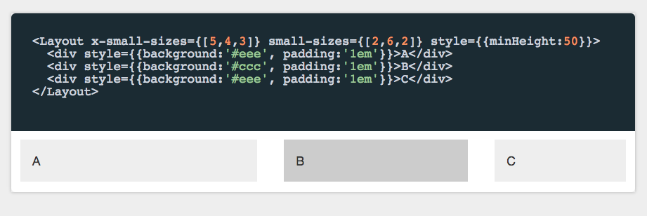

Layout
======

Layout is a responsive helper component that we use in our responsive designs at [Walmart Labs](http://walmartlabs.com).

This screenshot shows a simple multi-column layout using the Bootstrap grid.



In this case it's 3 columns wide in `x-small` and 4 columns wide in `small`.

In this next example we show specifying the widths of the individual columns (in 12 column layout values) for both `x-small` and `small`.



## Running the example

To install and run do:

```
npm install
npm run showcase
```
